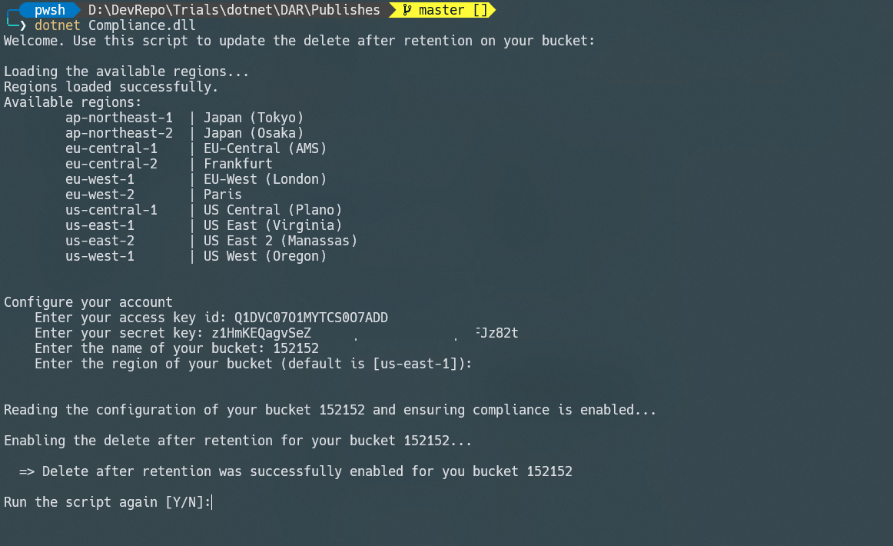

# Wasabi compliance: Delete after retention editor

Use the tool to update the Delete After Retention flag on any bucket that have compliance enabled.

## Prerequisite:

- dotnet runtime
- dotnet cli (for linux and Mac Osx)

## How to run?

```
dotnet Compliance.dll
```

## Execution:

1 Enter your Access key ID
2 Enter your Secret Key
3 Enter your bucket name
4 Enter the region of your bucket (by default it's us-east-1)

The region needs to be one of the listed regions at the start of the script!
In case you specify a wrong region, you will get a 403 error!
In case the bucket does not exist in your Wasabi account, a 404 error will be shown in the screen


